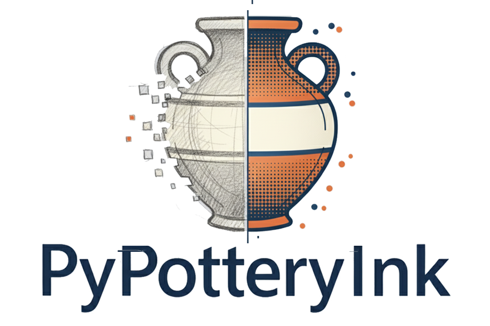
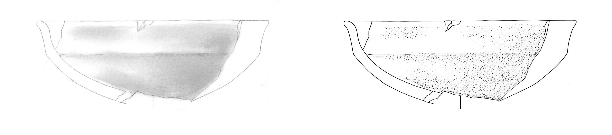
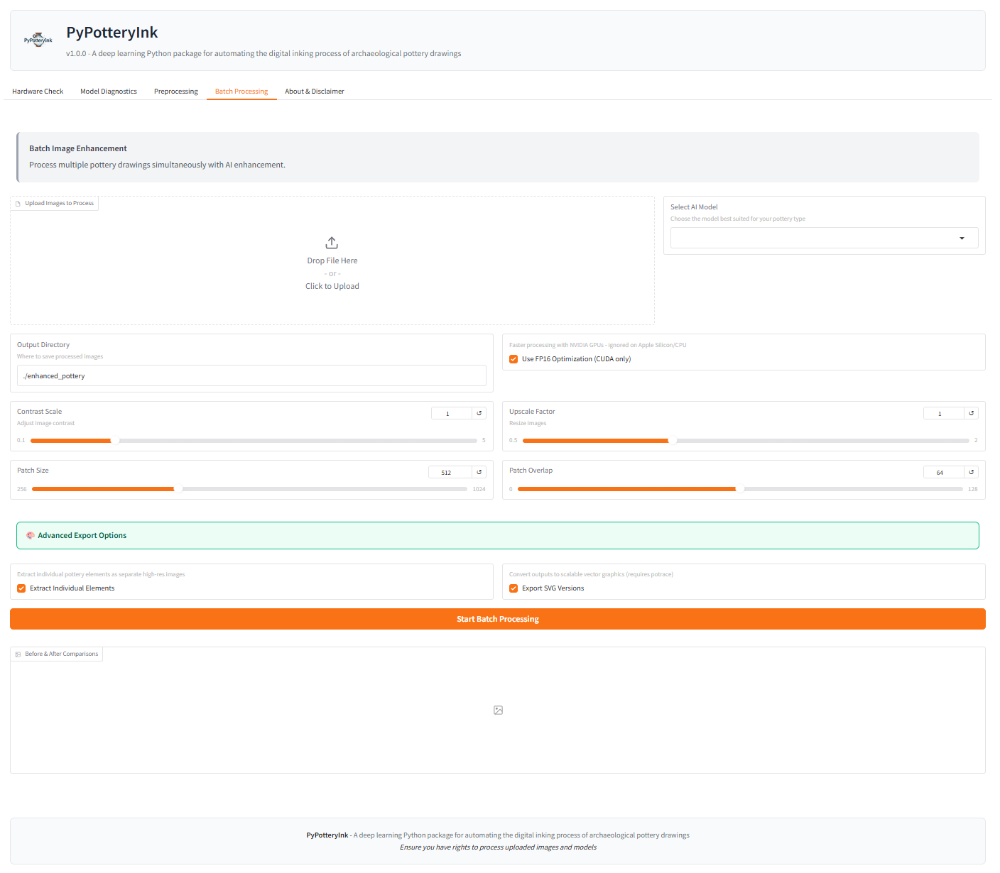

# PyPotteryInk

<div align="center">



[](https://lrncrd.github.io/PyPotteryInk/)
[](https://lrncrd.github.io/PyPotteryInk/)
[](https://huggingface.co/lrncrd/PyPotteryInk)
[](https://www.python.org/downloads/)
[](https://doi.org/10.1016/j.culher.2025.06.016)
[](https://github.com/lrncrd/PyPotteryInk)


*Transform archaeological pottery drawings into publication-ready illustrations with AI*

🚀 Try the [demo](https://githubtocolab.com/lrncrd/PyPotteryInk/blob/main/PyPotteryInk_example.ipynb) on Google Colab 🚀


</div>

## 🎯 Overview

As part of the **PyPottery** toolkit, `PyPotteryInk` is a deep learning application for automating the digital inking process of archaeological pottery drawings. It transforms pencil drawings into publication-ready illustrations while preserving the original characteristics and enhancing their analytical power.

<div align="center">

<p><em>Example of PyPotteryInk transformation: from pencil sketch to publication-ready illustration</em></p>
</div>

## ✨ Features

- 🚀 **Single-Step Translation**: Convert pencil drawings to inked versions using state-of-the-art diffusion models
- 🖼️ **High-Resolution Processing**: Advanced patch-based system for handling large drawings
- 🎨 **Stippling Control**: Fine-grained control over dot patterns and shading
- 📂 **Batch Processing**: Efficient handling of multiple drawings
- 🖥️ **Multi-GPU Support**: Now supports CUDA (NVIDIA), MPS (Apple Silicon M1/M2/M3), and CPU fallback
- 🌐 **Web Interface**: User-friendly Gradio interface for easy access
- 📊 **Preprocessing Tools**: Built-in image analysis and optimization with detailed statistics visualization
- 🔧 **Easy Installation**: One-click installation scripts for all major operating systems
- 📦 **Element Extraction**: Automatically extract individual pottery elements as separate high-resolution images
- 🎨 **SVG Export**: Convert outputs to scalable vector graphics for publication flexibility

## 🚀 Quick Start

### Installation

PyPotteryInk includes a unified installation script that works on all platforms:

```bash
git clone https://github.com/lrncrd/PyPotteryInk.git
cd PyPotteryInk
python install.py
```

The installation script will:
- Create a virtual environment
- Install all dependencies
- Download required models
- Set up the application

### Running the Application

After installation:
- **Windows**: Double-click `run.bat` or run it from terminal
- **macOS/Linux**: Run `./run.sh` or `python app.py`

The web interface will open automatically in your browser at `http://127.0.0.1:7860` (or the next available port).

### Web Interface

Version 1.0.0 introduces a user-friendly web interface powered by Gradio.

<div align="center">

</div>

1. **Hardware Check Tab**: Verify your system meets requirements
2. **Model Diagnostics Tab**: Test different settings before processing
3. **Preprocessing Tab**: 
   - Calculate detailed statistics from your dataset
   - View distribution plots and summary tables
   - Apply optimizations based on statistical analysis
4. **Batch Processing Tab**: Process multiple images with real-time progress
   - **Advanced Export Options**:
     - Extract individual pottery elements as separate high-resolution images
     - Export to SVG format for scalable vector graphics

## 📚 Documentation

<div align="center">
  <a href="https://lrncrd.github.io/PyPotteryInk/">
    
  </a>
</div>

## 🤖 Available Models

| Model | Description | Checkpoint Size | Link |
|-------|-------------|------|------|
| **10k Model** | General-purpose model for pottery drawings | 38.3MB | [Download](https://huggingface.co/lrncrd/PyPotteryInk/resolve/main/model_10k.pkl?download=true) |
| **6h-MCG Model** | High-quality model for Bronze Age drawings | 38.3MB | [Download](https://huggingface.co/lrncrd/PyPotteryInk/resolve/main/6h-MCG.pkl?download=true) |
| **6h-MC Model** | High-quality model for Protohistoric and Historic drawings | 38.3MB | [Download](https://huggingface.co/lrncrd/PyPotteryInk/resolve/main/6h-MC.pkl?download=true) |
| **4h-PAINT Model** | Tailored model for Historic and painted pottery | 38.3MB | [Download](https://huggingface.co/lrncrd/PyPotteryInk/resolve/main/4h-PAINT.pkl?download=true) |


All models support custom fine-tuning for specific archaeological contexts or styles.

## ⚡ Benchmarks

| GPU                 | Processing time for `test_image.jpg` (s) | FP16 Support |
| ------------------- | -------------------------------- | ------------ |
| 3070Ti (Windows 11) | ~50-55                     | ✅ Yes        |
| T4 (Google Colab)   | ~55-60                           | ✅ Yes        |
| M2 Pro (macOS)      | ~65-75                          | ❌ No (FP32)  |
| M1 (macOS)          | ~80-90                          | ❌ No (FP32)  |
| CPU (i7-9700K)     | ~300-400                        | ❌ No (FP32)  |

**Note**: FP16 (half precision) is only supported on CUDA GPUs. Apple Silicon (MPS) and CPU use FP32 for stability. 


## 🖥️ System Requirements

### Minimum Requirements
- **CPU**: 4+ cores (Intel i5/AMD Ryzen 5 or better)
- **RAM**: 8GB (16GB recommended)
- **GPU**: 
  - NVIDIA: GTX 1060 6GB or better (RTX series recommended)
  - Apple: M1/M2/M3 with 8GB+ unified memory
- **Storage**: 5GB free space for models and processing
- **OS**: Windows 10/11, macOS 11+, Linux (Ubuntu 20.04+)

### GPU Support
- **CUDA (NVIDIA)**: Full support with FP16 optimization
- **MPS (Apple Silicon)**: Full support with FP32 (automatic)
- **CPU**: Fallback mode (significantly slower)

### Optional Dependencies for Advanced Features

#### SVG Export (requires potrace)
To enable SVG export functionality, install potrace:
- **macOS**: `brew install potrace`
- **Linux**: `sudo apt-get install potrace`
- **Windows**: Download from [potrace.sourceforge.net](http://potrace.sourceforge.net/#downloading)

## 📢 AI Disclosure and Citation

PyPotteryInk uses Generative AI to translate archaeological pottery drawings into publication-ready illustrations. To promote transparency about the use of Generative AI and proper attribution in scientific research, is required all users to include the following disclosure statement in any publication, presentation, or report that utilizes PyPotteryInk:

```
This research utilized PyPotteryInk (version 1.0) for the AI-assisted translation of [number] pottery drawings. PyPotteryInk is a generative AI tool developed by Lorenzo Cardarelli (https://github.com/lrncrd/PyPotteryInk).
```

Where you need to specify the software version and the number of processed pottery drawings.

### Usage Reporting

By using PyPotteryInk, you agree to:

1. Clearly indicate in your methods section which model was used (e.g., "10k Model", "6h-MCG Model" or a custom model)
2. Specify the number of images processed with PyPotteryInk
3. Include the version number of PyPotteryInk used in your research

### Citation

If you use PyPotteryInk in your research, please cite:

```bibtex
@software{cardarelli2025pypotteryink,
  author = {Cardarelli, Lorenzo},
  title = {PyPotteryInk: Transform archaeological pottery drawings into publication-ready illustrations with AI},
  year = {2025},
  url = {https://github.com/lrncrd/PyPotteryInk},
  version = {1.0}
}
```

or 

```bibtex
@article{cardarelli_pypotteryink_2025,
	title = {{PyPotteryInk}: One-step diffusion model for sketch to publication-ready archaeological drawings},
	volume = {74},
	issn = {1296-2074},
	url = {https://www.sciencedirect.com/science/article/pii/S1296207425001268},
	doi = {10.1016/j.culher.2025.06.016},
	shorttitle = {{PyPotteryInk}},
	pages = {300--310},
	journaltitle = {Journal of Cultural Heritage},
	author = {Cardarelli, Lorenzo},
	date = {2025-07-01},
	keywords = {Archaeological drawing, Diffusion models, Generative {AI}, Image-to-image translation, Pottery},
}
```


## 👥 Contributors

<a href="https://github.com/lrncrd/PyPotteryInk/graphs/contributors">
  
</a>


Developed with ❤️ by [Lorenzo Cardarelli](https://github.com/lrncrd)

Based on img2img-turbo by [GaParmar](https://github.com/GaParmar/img2img-turbo)

The original code was released under the MIT Licence. The changes made in this fork are released under the Apache License 2.0.

## 🆕 What's New in Version 1.0

- **Multi-GPU Support**: Added support for Apple Silicon (M1/M2/M3) GPUs via Metal Performance Shaders
- **Gradio Web Interface**: New user-friendly web interface with multiple tabs:
  - Hardware Check: Verify system compatibility
  - Model Diagnostics: Preview processing with different settings
  - Preprocessing: Analyze and optimize images before processing
  - Batch Processing: Process multiple images with progress tracking
- **Automated Installation**: One-click installation scripts for all platforms
- **Improved Compatibility**: Fixed compatibility issues with various diffusers/PEFT versions
- **Real-time Progress**: See processing progress directly in the web interface
- **Enhanced Error Handling**: Better error messages and recovery options
- **Statistics Visualization**: New detailed statistics analysis with:
  - Summary tables showing all key metrics
  - Interactive distribution plots
  - Histogram and KDE visualizations
  - Box plots for metric overview
- **Smart Port Management**: Automatic port selection if default port is busy
- **Advanced Export Options**:
  - Element extraction: Automatically identify and extract individual pottery elements
  - SVG export: Convert processed images to scalable vector graphics for publication

## 🛠️ Development Setup

For developers who want to contribute:

```bash
git clone https://github.com/lrncrd/PyPotteryInk.git
cd PyPotteryInk
python -m venv venv
source venv/bin/activate  # On Windows: venv\Scripts\activate
pip install -r requirements.txt
```

## 🐛 Troubleshooting

### Common Issues


1. **Out of memory errors**
   - Reduce patch size in settings (try 384 or 256)
   - Close other applications
   - Use CPU mode as fallback (slower but more stable)

2. **Models not downloading**
   - Check your internet connection
   - Models are downloaded from Hugging Face (may be blocked in some regions)
   - Manual download links are available in the table above

3. **Port already in use error**
   - The app now automatically finds an available port
   - If you see this error with older versions, close other Gradio instances
   - Or manually specify a port: `GRADIO_SERVER_PORT=7861 python app.py`

4. **Statistics visualization not showing**
   - Ensure scipy is installed: `pip install scipy`
   - Check that you have at least 2 images for meaningful statistics
   - Verify the "Generate visualization plots" checkbox is enabled

5. **SVG export not working**
   - Install potrace (see Optional Dependencies section above)
   - Ensure potrace is in your system PATH
   - Check that the "Export SVG Versions" checkbox is enabled
   - Note: SVG export works best with high-contrast binary images

---
