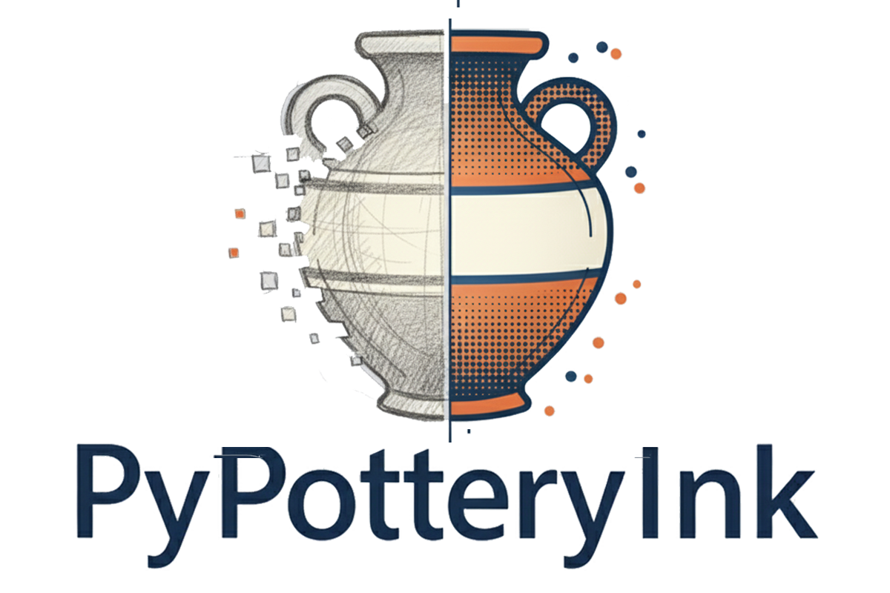
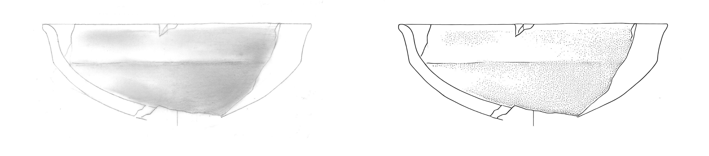
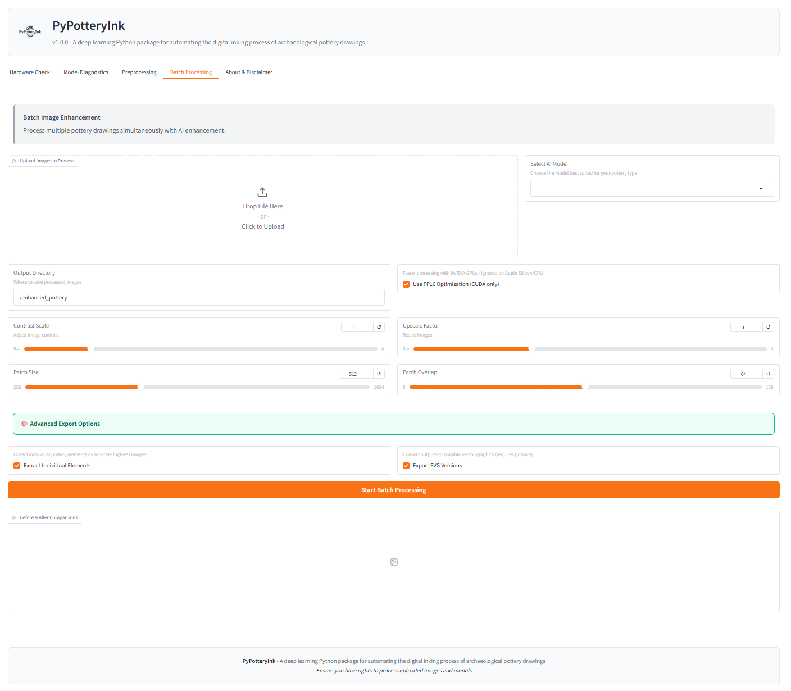

# PyPotteryInk

<div align="center">



[](https://www.python.org/downloads/)
[](https://lrncrd.github.io/PyPottery/community.html)
[](https://github.com/lrncrd/PyPotteryInk)
[](https://github.com/lrncrd/PyPotteryInk)
[](https://huggingface.co/lrncrd/PyPotteryInk)
[](https://doi.org/10.1016/j.culher.2025.06.016)

*Transform archaeological pottery drawings into publication-ready illustrations with AI*

🚀 Try the [demo](https://githubtocolab.com/lrncrd/PyPotteryInk/blob/main/PyPotteryInk_example.ipynb) on Google Colab 🚀

</div>

---

## Introduction

As part of the **PyPottery** toolkit, **PyPotteryInk** is a deep learning application for automating the digital inking process of archaeological pottery drawings. It transforms pencil drawings into publication-ready illustrations while preserving the original characteristics and enhancing their analytical power.

<div align="center">

<p><em>From pencil sketch to publication-ready illustration</em></p>
</div>

## ✨ Features

- **Single-Step Translation**: Convert pencil drawings to inked versions using state-of-the-art diffusion models
- **High-Resolution Processing**: Patch-based system for handling large drawings
- **Stippling Control**: Fine-grained control over dot patterns and shading
- **Batch Processing**: Efficient handling of multiple drawings with real-time progress
- **Multi-GPU Support**: CUDA (NVIDIA), MPS (Apple Silicon) and CPU fallback
- **Web Interface**: Local Flask interface with hardware check, model management, diagnostics and preprocessing statistics
- **Custom Models**: Upload and use your own fine-tuned models

<div align="center">

</div>

## 🚀 Quick Start

### Option 1 — PyPottery Suite Launcher (recommended)

The easiest way to get started, no Python installation required.

<p align="center">
  <a href="https://github.com/lrncrd/PyPottery/releases/latest">
    
  </a>
</p>

1. Grab the installer for your OS from [Releases](https://github.com/lrncrd/PyPottery/releases/latest)
2. Run it (Windows) or drag-to-Applications (macOS) — no Python install required
3. Launch PyPotteryInk from the suite launcher; updates are handled automatically

### Option 2 — Manual installation (from source)

For developers, or anyone who wants to run the app on its own:

```bash
# Clone repository
git clone https://github.com/lrncrd/PyPotteryInk.git
cd PyPotteryInk

# Install dependencies
pip install -r requirements.txt

# Run the app
python app.py
# Then open http://127.0.0.1:5003 in your browser
```

Models are downloaded from the **Model Management** tab of the interface. A one-step installer that also creates a virtual environment is available too: `python install.py`.

## 📋 System Requirements

- **Python**: 3.11+
- **Operating System**: Windows 10/11, macOS 11+, Linux (Ubuntu 20.04+)
- **CPU / RAM**: 4+ cores, 8GB RAM (16GB recommended)
- **GPU** (optional but strongly recommended): NVIDIA GTX 1060 6GB or better (CUDA, FP16), or Apple Silicon M1/M2/M3 with 8GB+ unified memory (MPS, FP32). CPU-only works but is significantly slower
- **Storage**: 5GB free for models and processing

Benchmarks per GPU are in the [Model Zoo](https://lrncrd.github.io/PyPottery/pypotteryink/model_zoo.html) page.

## 🎯 Usage

1. **Check your hardware** in the *Hardware Check* tab
2. **Download a model** from *Model Management* (or upload your own)
3. **Test settings** on a single drawing in *Model Diagnostics*
4. *(Optional)* **Preprocess**: compute dataset statistics and apply suggested optimizations
5. **Batch process** a folder of drawings and follow the real-time progress

For the full walkthrough, see the **[Usage Guide](https://lrncrd.github.io/PyPottery/pypotteryink/usage.html)**. Something not working? See the [Getting Started guide](https://lrncrd.github.io/PyPottery/pypotteryink/index.html#troubleshooting) and the tips in [Advanced](https://lrncrd.github.io/PyPottery/pypotteryink/advanced.html).

## 🤖 Available Models

| Model | Description | Download |
|-------|-------------|------|
| **10k Model** | General-purpose model for pottery drawings | [Download](https://huggingface.co/lrncrd/PyPotteryInk/resolve/main/model_10k.pkl?download=true) |
| **6h-MCG Model** | High-quality model for Bronze Age drawings | [Download](https://huggingface.co/lrncrd/PyPotteryInk/resolve/main/6h-MCG.pkl?download=true) |
| **6h-MC Model** | High-quality model for Protohistoric and Historic drawings | [Download](https://huggingface.co/lrncrd/PyPotteryInk/resolve/main/6h-MC.pkl?download=true) |
| **4h-PAINT Model** | Tailored model for Historic and painted pottery | [Download](https://huggingface.co/lrncrd/PyPotteryInk/resolve/main/4h-PAINT.pkl?download=true) |
| **5h-PAPERGRID Model** | Tailored model for paper grid tables (does not support shadows) | [Download](https://huggingface.co/lrncrd/PyPotteryInk/resolve/main/5h_PAPERGRID.pkl?download=true) |

All models are ~38MB and support custom fine-tuning for specific archaeological contexts or styles. Details: [Model Zoo](https://lrncrd.github.io/PyPottery/pypotteryink/model_zoo.html).

## 📊 What's New

See the **[Version History](https://lrncrd.github.io/PyPottery/pypotteryink/version_history.html)** for the full changelog.

## 📢 AI Disclosure and Citation

PyPotteryInk uses Generative AI to translate archaeological pottery drawings into publication-ready illustrations. To promote transparency about the use of Generative AI and proper attribution in scientific research, all users are required to include the following disclosure statement in any publication, presentation, or report that utilizes PyPotteryInk:

```
This research utilized PyPotteryInk (version 2.0) for the AI-assisted translation of [number] pottery drawings. PyPotteryInk is a generative AI tool developed by Lorenzo Cardarelli (https://github.com/lrncrd/PyPotteryInk).
```

Where you need to specify the software version and the number of processed pottery drawings.

### Usage Reporting

By using PyPotteryInk, you agree to:

1. Clearly indicate in your methods section which model was used (e.g., "10k Model", "6h-MCG Model" or a custom model)
2. Specify the number of images processed with PyPotteryInk
3. Include the version number of PyPotteryInk used in your research

### Citation

If you use PyPotteryInk in your research, please cite:

```bibtex
@software{cardarelli2025pypotteryink,
  author = {Cardarelli, Lorenzo},
  title = {PyPotteryInk: Transform archaeological pottery drawings into publication-ready illustrations with AI},
  year = {2025},
  url = {https://github.com/lrncrd/PyPotteryInk},
  version = {2.0}
}
```

or

```bibtex
@article{cardarelli_pypotteryink_2025,
	title = {{PyPotteryInk}: One-step diffusion model for sketch to publication-ready archaeological drawings},
	volume = {74},
	issn = {1296-2074},
	url = {https://www.sciencedirect.com/science/article/pii/S1296207425001268},
	doi = {10.1016/j.culher.2025.06.016},
	shorttitle = {{PyPotteryInk}},
	pages = {300--310},
	journaltitle = {Journal of Cultural Heritage},
	author = {Cardarelli, Lorenzo},
	date = {2025-07-01},
	keywords = {Archaeological drawing, Diffusion models, Generative {AI}, Image-to-image translation, Pottery},
}
```

## 👥 Contributors

<a href="https://github.com/lrncrd/PyPotteryInk/graphs/contributors">
  
</a>

## ☕ Support This Project

If you find PyPotteryInk useful for your research, consider supporting its development:

[](https://ko-fi.com/lrncrd)

Your support helps maintain and improve this open-source tool for the archaeological community!

---

Developed with ❤️ by [Lorenzo Cardarelli](https://github.com/lrncrd) · Based on [img2img-turbo](https://github.com/GaParmar/img2img-turbo) by GaParmar — the original code is used under its own terms (MIT Licence), and its notice is kept in this repository.
