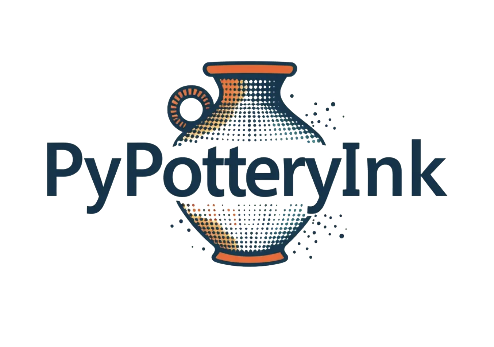

# PyPotteryInk

*Transform archaeological pottery drawings into publication-ready illustrations with AI*

## 🎯 Overview

As part of the **PyPottery** toolkit, `PyPotteryInk` is a deep learning application for automating the digital inking process of archaeological pottery drawings. It transforms pencil drawings into publication-ready illustrations while preserving the original characteristics and enhancing their analytical power.

<em>Example of PyPotteryInk transformation: from pencil sketch to publication-ready illustration</em>

## ✨ Features

- 🚀 **Single-Step Translation**: Convert pencil drawings to inked versions using state-of-the-art diffusion models
- 🖼️ **High-Resolution Processing**: Advanced patch-based system for handling large drawings
- 🎨 **Stippling Control**: Fine-grained control over dot patterns and shading
- 📂 **Batch Processing**: Efficient handling of multiple drawings

## 📚 Documentation

  

## 🤖 Available Models

| Model | Description | Checkpoint Size | Link |
|-------|-------------|------|------|
| **10k Model** | General-purpose model for pottery drawings | 38.3MB | [Download](https://huggingface.co/lrncrd/PyPotteryInk/resolve/main/model_10k.pkl?download=true) |
| **6h-MCG Model** | High-quality model for Bronze Age drawings | 38.3MB | [Download](https://huggingface.co/lrncrd/PyPotteryInk/resolve/main/6h-MCG.pkl?download=true) |

All models support custom fine-tuning for specific archaeological contexts or styles.

## ⚡ Benchmarks

| GPU                 | Mean processing time for $512 \cdot 512$ pixel patch (s) |
| ------------------- | -------------------------------- |
| 3070Ti (Windows 11) | 6.62                             |
| 3060 (Windows 11)   | 21.29                            |
| 3060 (WSL Ubuntu)   | 20.89                            |
| T4 (Google Colab)   | 0.56                             |

The benchmarks were performed using the `test.py` script. 

## 👥 Contributors

Developed with ❤️ by [Lorenzo Cardarelli](https://github.com/lrncrd)

Based on img2img-turbo by [GaParmar](https://github.com/GaParmar/img2img-turbo)

---
